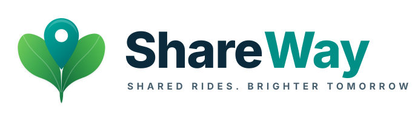

<p align="center">
  
</p>

<p align="center">
  <strong>Shared Rides. Brighter Tomorrows.</strong><br>
  A modern, eco-friendly community ridesharing and carpooling platform connecting drivers and commuters heading the same way.
</p>

<p align="center">
  
  
  
  
  
  
  
  
  
</p>

---

## 🌟 Overview

**ShareWay** is a community-driven web ridesharing platform built to make daily commuting affordable, accessible, and environmentally sustainable. By matching drivers who have empty seats with commuters traveling along the same route, ShareWay helps reduce traffic congestion, lower travel costs, and cut vehicular carbon emissions.

Built as a high-performance modern monorepo using **React 19**, **Vite**, **Tailwind CSS v4**, **Node.js/Express**, and **MongoDB Atlas**, ShareWay combines interactive route visualization, role-based access control, and real-time event infrastructure.

---

## ✨ Key Features

- **🚗 Interactive Ride Publishing (Drivers)**
  - Plan routes with interactive pickup and dropoff points using **Leaflet.js** and **OpenStreetMap**.
  - Automatic turn-by-turn route previews, distance estimation, and duration calculation powered by **OSRM** (Open Source Routing Machine).
  - Flexible scheduling (single or recurring trips), intermediate stops, price per seat, and vehicle selection.

- **🔍 Smart Ride Discovery & Filtering (Passengers)**
  - Real-time ride search by origin, destination, and travel date.
  - Granular filters for available seats, price range, and earliest departure.
  - Detailed ride view modal showcasing driver verification status, vehicle specifications, seat availability, and route milestones.

- **🛡️ Secure Authentication & Role-Based Access Control (RBAC)**
  - Dual-token JWT security model: short-lived access tokens + secure, HTTP-only refresh token rotation.
  - Roles: `passenger`, `driver`, and `admin` with dedicated navigation and permission guards.
  - Strict input validation on all payloads using **Zod** schemas.
  - Password hashing with **bcrypt**.

- **🗺️ Geospatial & Mapping Integration**
  - Interactive map integration without expensive proprietary map APIs.
  - Real-time geolocation autocomplete and coordinates geocoding.

- **⚡ Real-Time Architecture**
  - **Socket.io** integration for instant booking alerts, status updates, and interactive notifications.

- **📊 Comprehensive User Dashboard**
  - Unified dashboard with role-switching views:
    - **Dashboard Overview**: Recent rides, booking activity, and statistics.
    - **My Rides**: Manage published journeys, view passenger manifests, and control trip statuses.
    - **Bookings**: Track reserved seats and travel itineraries.
    - **Vehicles**: Register and manage driver vehicles.
    - **Profile & Settings**: Manage user credentials, emergency contacts, and preferences.

---

## 🛠️ Tech Stack

| Layer | Technologies |
|---|---|
| **Frontend** | React 19, Vite, Tailwind CSS v4, Lucide React, Leaflet.js, React Router v7 |
| **Backend** | Node.js, Express.js, Socket.io, Mongoose (MongoDB ODM), Zod, Cookie-Parser |
| **Database** | MongoDB Atlas (Cloud) / Local MongoDB via Docker |
| **Mapping & Routing** | OpenStreetMap (OSM) Tiles, OSRM (Open Source Routing Machine) |
| **Authentication** | JSON Web Tokens (Access + HTTP-only Refresh Cookies), Bcrypt |
| **Development & Tooling** | Concurrently, Nodemon, Oxlint, Docker Compose |

---

## 📁 Repository Structure

```
ShareWay/
├── client/                     # Frontend Application (React 19 + Vite + Tailwind CSS v4)
│   ├── public/                 # Static brand vectors and icons
│   ├── src/
│   │   ├── assets/             # Client graphics and images
│   │   ├── components/         # Modular UI components (Navbar, Hero, Modals, Maps)
│   │   │   ├── dashboard/      # Dashboard navigation, topbar, and sidebar
│   │   │   └── map/            # Leaflet RouteMap component
│   │   ├── context/            # React Contexts (AuthContext)
│   │   ├── pages/              # Primary views (HomePage, RidesPage, DashboardPage)
│   │   │   └── dashboard/      # Sub-views (Overview, MyRides, Bookings, Vehicles, Profile)
│   │   ├── services/           # Axios/Fetch API client with token auto-refresh
│   │   ├── App.jsx             # Main Application routing layout
│   │   └── index.css           # Tailwind v4 theme styling
│   ├── .env.example            # Client environment template
│   └── package.json
│
├── server/                     # Backend API & Socket Server (Node.js + Express)
│   ├── src/
│   │   ├── config/             # MongoDB Atlas connection setup
│   │   ├── controllers/        # Route controllers (Auth, Rides, Users)
│   │   ├── middleware/         # JWT verification, RBAC guards, error handling
│   │   ├── models/             # Mongoose schemas (User, Driver, Ride, Booking, Vehicle, etc.)
│   │   ├── routes/             # Express API route endpoints
│   │   ├── services/           # Business logic & OSRM routing client
│   │   ├── sockets/            # Socket.io connection and event handlers
│   │   ├── utils/              # Token generators and helper functions
│   │   ├── validators/         # Zod schemas for request validation
│   │   ├── app.js              # Express application configuration
│   │   └── server.js           # Server bootstrap & HTTP/WebSocket listener
│   ├── .env.example            # Server environment template
│   └── package.json
│
├── assets/                     # Brand logos, vectors, and design assets
├── docker-compose.yml          # Optional local MongoDB container configuration
├── package.json                # Root monorepo workspace scripts (concurrently)
└── README.md                   # Project documentation
```

---

## 🚀 Getting Started

Follow these instructions to set up ShareWay locally for development.

### 1. Prerequisites

- **Node.js**: v18.0.0 or higher (v20+ recommended)
- **npm**: v9.0.0 or higher
- **MongoDB**: Free [MongoDB Atlas Cluster](https://www.mongodb.com/cloud/atlas) or local [Docker](https://www.docker.com/)

### 2. Clone the Repository

```bash
git clone https://github.com/afaque-codes/ShareWay.git
cd ShareWay
```

### 3. Install Dependencies

Install all root, server, and client dependencies with a single command from the project root:

```bash
npm install
```

### 4. Configure Environment Variables

#### Backend (`server/.env`):
Create a `.env` file in the `server` directory based on `server/.env.example`:

```bash
cp server/.env.example server/.env
```

Edit `server/.env` with your settings:

```env
PORT=5000
NODE_ENV=development
CLIENT_URL=http://localhost:5173

# MongoDB Atlas Connection String
MONGODB_URI=mongodb+srv://<username>:<password>@<cluster>.mongodb.net/shareway?retryWrites=true&w=majority

# JWT Authentication Secrets
JWT_SECRET=your_jwt_access_secret_key_here
JWT_REFRESH_SECRET=your_jwt_refresh_secret_key_here
JWT_EXPIRES_IN=15m
JWT_REFRESH_EXPIRES_IN=7d

# Routing Engine
OSRM_BASE_URL=http://router.project-osrm.org
```

*(Optional: For local development with Docker rather than MongoDB Atlas, run `npm run docker:db:up` and set `MONGODB_URI=mongodb://localhost:27017/shareway`)*

#### Frontend (`client/.env` - Optional):
In development, the Vite server automatically proxies `/api` calls to `http://localhost:5000`. For custom setups:

```bash
cp client/.env.example client/.env
```

### 5. Run the Application

Start both the backend server and frontend development server simultaneously:

```bash
npm run dev
```

Once started:
- 💻 **Frontend Web App:** [http://localhost:5173](http://localhost:5173)
- 🔌 **Backend API Health Check:** [http://localhost:5000/api/health](http://localhost:5000/api/health)

---

## 📜 Available Scripts

Run these scripts from the repository root:

| Command | Description |
|---|---|
| `npm run dev` | Runs both client (Vite) and server (Nodemon) concurrently |
| `npm run client:dev` | Runs only the frontend Vite development server |
| `npm run server:dev` | Runs only the backend Express server with auto-reload |
| `npm run build` | Builds the client application for production |
| `npm run lint` | Lints the frontend codebase with Oxlint |
| `npm run docker:db:up` | Boots up a local MongoDB container using Docker Compose |
| `npm run docker:db:down` | Shuts down the local MongoDB Docker container |

---

## 🔌 API Endpoints Summary

### Authentication (`/api/auth`)
- `POST /api/auth/register` — Register a new account (`passenger` or `driver`)
- `POST /api/auth/login` — Sign in and receive JWT credentials
- `POST /api/auth/refresh` — Refresh access token via HTTP-only cookie
- `POST /api/auth/logout` — Clear session cookies and sign out
- `GET  /api/auth/me` — Retrieve current authenticated user profile

### Rides (`/api/rides`)
- `GET  /api/rides` — Search published rides with origin, destination, and date filters
- `GET  /api/rides/my-rides` — Retrieve rides created by authenticated driver
- `GET  /api/rides/:id` — Get comprehensive details for a specific ride
- `POST /api/rides/preview` — Generate OSRM route geometry, distance, and duration preview
- `POST /api/rides` — Create a new ride (Draft or Published)
- `PUT  /api/rides/:id/publish` — Publish a drafted ride
- `DELETE /api/rides/:id` — Cancel/delete a scheduled ride

### Health Check
- `GET  /api/health` — Service status check

---

## ☁️ Deployment Guide

### Frontend on Vercel
1. Push your repository to GitHub.
2. Sign in to [Vercel](https://vercel.com) and click **Add New** → **Project**.
3. Select your `ShareWay` repository.
4. Set the **Root Directory** to `client`.
5. Under **Environment Variables**, set:
   - `VITE_API_URL` = `https://your-backend-service.onrender.com/api`
   - `VITE_SOCKET_URL` = `https://your-backend-service.onrender.com`
6. Click **Deploy**.

### Backend on Render
1. Sign in to [Render](https://render.com) and create a new **Web Service**.
2. Connect your GitHub repository.
3. Set the **Root Directory** to `server`.
4. Set the following configuration:
   - **Environment:** `Node`
   - **Build Command:** `npm install`
   - **Start Command:** `npm start`
5. Configure Environment Variables:
   - `NODE_ENV` = `production`
   - `CLIENT_URL` = `https://your-shareway-app.vercel.app`
   - `MONGODB_URI` = `mongodb+srv://<user>:<password>@cluster.mongodb.net/shareway?retryWrites=true&w=majority`
   - `JWT_SECRET` = `<generated-strong-secret>`
   - `JWT_REFRESH_SECRET` = `<generated-strong-secret>`
   - `OSRM_BASE_URL` = `http://router.project-osrm.org`
6. Click **Create Web Service**.

---

## 🤝 Contributing

Contributions make the open-source community an inspiring place to learn, inspire, and create. Any contributions you make are **greatly appreciated**.

1. **Fork** the Project
2. Create your Feature Branch (`git checkout -b feature/AmazingFeature`)
3. Commit your Changes (`git commit -m 'Add some AmazingFeature'`)
4. Push to the Branch (`git push origin feature/AmazingFeature`)
5. Open a **Pull Request**

---

## 📄 License

Distributed under the **MIT License**. See `LICENSE` for more information.

---

<p align="center">
  Built with ❤️ for sustainable and connected communities.
</p>
